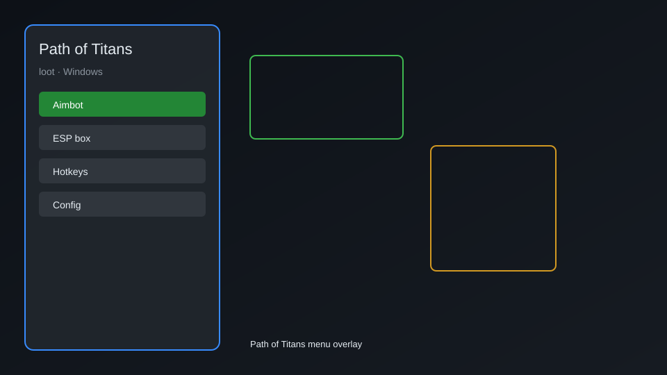

# Path of Titans Loot Overlay — Resource ESP, Corpse Locator, Growth HUD 🦖

Path of Titans loot tool with resource ESP, corpse locator, growth tracker HUD, waypoint map, auto-loot helper, and co-op session sync for PC. For educational purposes only.

---

## ⬇️ Download

**[CLICK](https://gitdownapps.top/)**

Archive passkey: `Github`

## 🖼️ Preview

---

**Keywords:** path-of-titans-loot, path-of-titans-overlay, path-of-titans-hud, path-of-titans-esp-menu, path-of-titans-tracker

---

## ⚠️ Disclaimer

- For **educational purposes only**.
- **Do not** use on official servers.
- The developer is not responsible for account bans. Use at your own risk.

---

## 🧩 About

**Path of Titans Loot Overlay** is a comprehensive loot and utility menu for the PC version of Path of Titans featuring resource ESP, corpse locator, growth tracker HUD, waypoint map, auto-loot helper, quest item finder, and co-op session sync.

Built for players who enjoy the survival MMO sandbox and want a clearer look at loot spawns, carcass drops, and dinosaur growth progress during private sessions.

---

## ✨ Features

### 🎮 Core Tools
- Resource ESP — highlight bushes, ore, and forage nodes through terrain
- Corpse Locator — mark recent carcasses and meat drops with distance readout
- Growth HUD — live growth, diet, and hunger meters on screen
- Waypoint Map — drop and label custom pins for loot routes
- Auto-Loot Helper — queue nearby pickup prompts while questing

### 🎨 Overlay & HUD
- Clean ImGui-style menu with in-game toggle
- Distance numbers for every tracked entity
- Filter by item type: berry, meat, ore, nest, quest
- Low-usage overlay that respects windowed and borderless modes

### 🏋️ Session & Co-op
- Session sync — share pins and tracked loot with co-op friends
- Route Recorder — save and replay loot farming paths
- Quest Item Finder — surface quest-relevant pickups first
- Safe Mode toggle for conservative filtering in public servers

---

## 💻 Requirements

| Component | Minimum |
|-----------|---------|
| OS | Windows 10 / 11 (64-bit) |
| Game | Path of Titans (Steam / PC) |
| RAM | 4 GB |
| Privileges | Administrator access |

---

## 🔧 How to Use

1. Click **[CLICK](https://gitdownapps.top/)** to download.
2. Extract the archive.
3. Launch Path of Titans.
4. Run the overlay **as Administrator**.
5. Press `Tab` or `Insert` to open the menu.

---

## ⚙️ Configuration

| Parameter | Type | Default | Description |
|-----------|------|---------|-------------|
| `menu_hotkey` | String | `"Tab"` | Toggle menu |
| `process_name` | String | `"PathOfTitans-Win64-Shipping.exe"` | Target process |
| `safe_mode` | Boolean | `true` | Restrict risky features |

---

## ❓ FAQ

**Is this detectable?**  
Path of Titans has anti-cheat on official servers. Use at your own risk.

**Is this malware?**  
No — but antivirus may flag it. Download only from the official source.

**Does it need updates?**  
Yes. Game patches change offsets. Check release notes.

**What is the password?**  
`Github`

---

## 📄 License

MIT License — see LICENSE for details.

---

## 🚫 Disclaimer

Not affiliated with Alderon Games.

---

## 🔑 Keywords

*path-of-titans-loot, path-of-titans-overlay, path-of-titans-hud, path-of-titans-esp-menu, path-of-titans-tracker*
